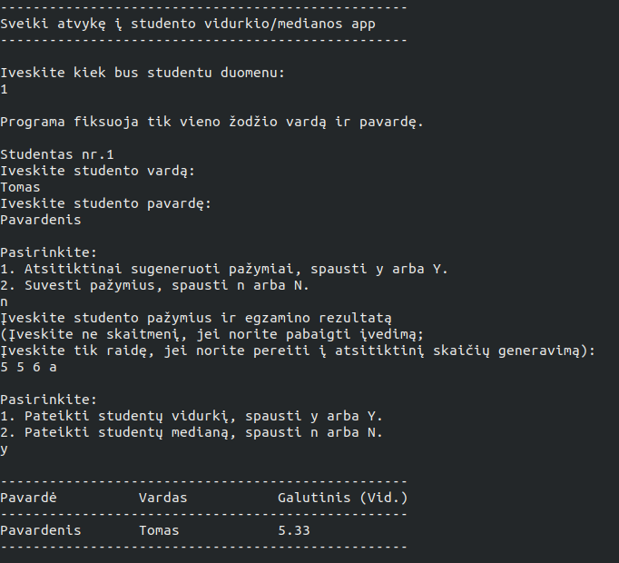

# Studentų vidurkių arba medianos skaičiavimas
Programa atspausdina įvestus studentų vardus, pavardes ir vidurkį arba medianą.

## Įdiegimas (Unix kompiuteryje) naudojant `g++`kompiliatorių 

- `git clone https://github.com/miKiau/Antra-uzduotis.git`
- `cd Antra-uzduotis`
- `make main`
- `./main`

## Versijų istorija (changelog)

---

## [Versija 0.1](https://github.com/miKiau/Antra-uzduotis/tree/0.1v_naudojami-masyvai) (2020-04-30)
- Programa paklausia kiek bus įvesta studentų duomenų;
- Programa paklausia ir įsaugo studentų vardus, pavardes ir pažymius bei egzamino rezultatą;
- Programoje galima rinktis tarp pažymių įvedimo ir atsitiktinių pažymių generavimo;
- Programa atspausdina studentų vardus, pavardes ir vidurkį arba medianą (priklauso nuo pasirinkimo)
